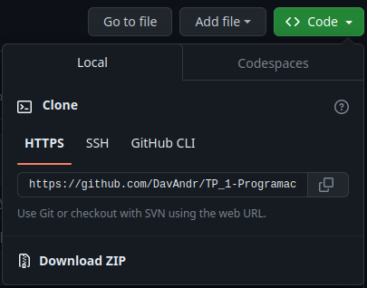

# Programacion III: Trabajo practico 1

>## **Introduction**
>This is the first group project of programming III,made by: Andrada David, Martinez Gonzalo y Tempesti Mateo.
---
>## **Features**
>This project will apply PyPDF, gTTS and playsound to make a PDF narrator that permits a easy solution to narration.
---
>## **Install**
>First you will have to check you have the correct python version, for that run
>```console
>$ python3 –version
>```
>If that doesnt return anything or it returns a version lower than python 3.10 run this:
>```console
>$ sudo apt update
>$ apt install python3.10
>```
>Once you do that download this repository by downloading the .zip
>
>
>Or, if you have git, run this in your terminal from where you want to download the files
>```console
>$ git clone https://github.com/DavAndr/TP_1-Programacion_III.git
>```
>Once that is done extract the .zip (if that's how you downloaded it), open the directory and run this on terminal:
>```console
>$ pip install requirements.txt
>```
---
>## **Usage**
>To run the program write this on terminal:
>```console
>$ python3 main.py
>```
---
>## **Documentation**
>- [gTTS documentation](http://gtts.readthedocs.org/)
>- [PyPDF documentation](https://pypdf.readthedocs.io/en/stable/)
>- [soundplay documentation](https://pypi.org/project/playsound/)
---
>## **Developers**
>- David Andrada
>- Mateo Tempesti
>- Gonzalo Martinez